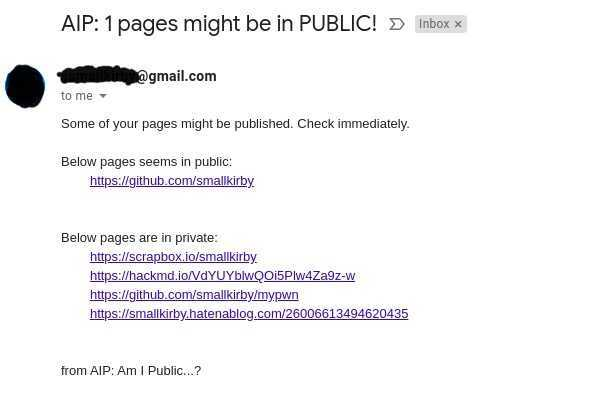

# AIP: Am I Public...?
Simple tool to check if you accidentally publish your pages.  
Intended to be used as cron task.  

  

## Cron and E-mail Integration
AIP supports non-interactive mode and e-mail notification.  
By registering AIP as cron task, you can check page status via e-mail w/o any interaction.  

## Progress
| Status | Functionality |
| ------------- | ------------- |
| ☁ | checker |
| ☀ | config |
| ☀ | non-interactive |
| ☀ | slack integration |
| ⛈ | slack integration |
  
### legend
- ☀️: completed
- 🌤: almost done, still needs more impls 
- ☁️: work in progress
- ⛈: totally untouched
